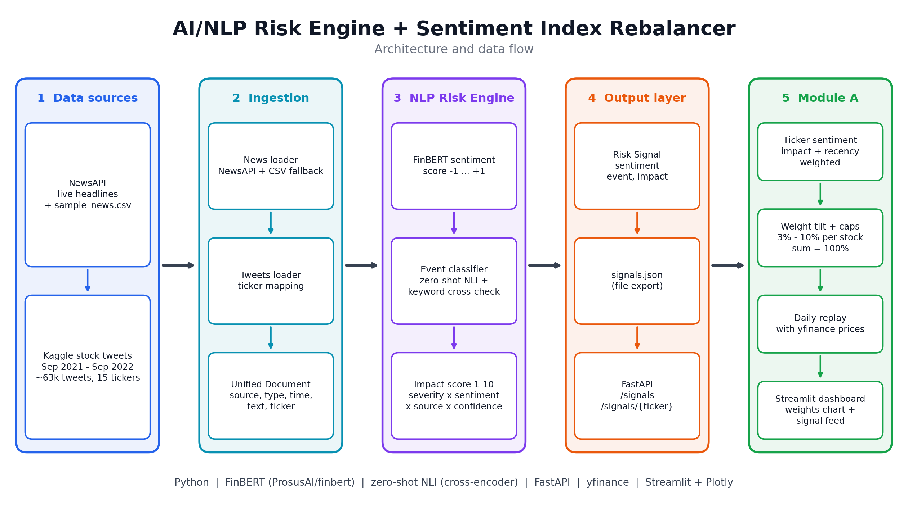

# AI/NLP Risk Engine + Sentiment Index Rebalancer - S&P Global & Crisil Campus Hackathon

**Candidate Name:** Sarthak Satish Borekar<br>
**College Email ID:** sarthak.23bce10568@vitbhopal.ac.in<br>
**College / Campus:** Vellore Institute of Technology - Bhopal<br>
**Demo Video Link:** To be added (YouTube, unlisted)<br>
**Slide Deck Link (if hosted externally):** see `docs/presentation.pdf`

## 1. Project Overview / Problem Statement & Approach

Banks and asset managers receive far more news and social media text than anyone can read in real time. This project turns that unstructured text into **structured, machine-readable risk signals**, and uses those signals to drive a downstream application.

**Core: AI/NLP Risk Engine.** It ingests text from two sources (financial news and stock tweets) and, for each document, outputs:

| Field | Meaning | Range |
|---|---|---|
| Sentiment Score | Positive / negative tone of the text | -1.0 to +1.0 |
| Event Classification | Type of event discussed | Credit Event, Geopolitical, Macroeconomic, Merger/Acquisition, Regulatory/Legal, Earnings, Product Launch, Other |
| Impact Score | Predicted market severity | 1 to 10 |

Signals are available as a JSON file (`data/signals.json`) and through a FastAPI service.

**Downstream: Module A, Tactical Index Rebalancer.** A mock index of 15 large-cap US stocks starts at equal weight. Each day the rebalancer raises the weight of stocks with positive sentiment and lowers the weight of stocks with negative sentiment, within position limits. A Streamlit dashboard shows the weights over time and the live signal feed.

### How each signal is produced

- **Sentiment:** FinBERT (`ProsusAI/finbert`), a BERT model fine-tuned on financial text. Score = P(positive) - P(negative).
- **Event type:** zero-shot classification with an NLI model (`cross-encoder/nli-distilroberta-base`) over eight event labels. It is cross-checked against a keyword baseline: if no event keyword matches and the model's confidence is below 0.90, the event becomes `Other`.
- **Impact score (1-10):** a transparent formula, not a trained model (there is no labeled impact data):

  `impact = 1 + 9 x severity x (0.4 + 0.6 x |sentiment|) x source_weight x (0.6 + 0.4 x event_confidence)`

  `severity` is a per-event-type weight (Credit Event 1.0, Geopolitical 0.95, Macroeconomic 0.85, Merger/Acquisition 0.65, Regulatory/Legal 0.60, Earnings 0.55, Product Launch 0.35, Other 0.15). `source_weight` is 1.0 for news and 0.7 for social media.

### How the rebalancer uses the signals

1. **Ticker sentiment:** mean sentiment per stock, weighted by impact and by recency (30-day lookback, 7-day half-life).
2. **Tilt:** each weight is multiplied by `1 + 0.5 x sentiment`, then all weights are renormalized to 100%.
3. **Position limits:** every stock is kept between 3% and 10%; any excess or shortfall is redistributed to the other stocks.
4. **Replay:** the process runs for every trading day from 2021-09-30 to 2022-09-29 against real prices.

## 2. Architecture & Tech Stack



- **Language / runtime:** Python
- **NLP:** Hugging Face `transformers`, PyTorch, FinBERT, NLI zero-shot classifier
- **Data and validation:** pandas, pydantic
- **API:** FastAPI + Uvicorn
- **Market data:** yfinance
- **Dashboard:** Streamlit + Plotly
- **Tests:** pytest

```
src/
  ingestion/   unified Document schema, news loader, tweets loader, ticker mapping
  engine/      sentiment, event classifiers, impact score, pipeline, signals.json export
  api/         FastAPI app
  rebalancer/  mock index, prices, weight tilt + caps, daily replay
  dashboard/   Streamlit app
data/          sample inputs and generated outputs (see Dataset Used)
docs/          architecture diagram, presentation
tests/         ingestion tests
```

## 3. Dataset Used

| File | Source | Notes |
|---|---|---|
| `data/sample_news.csv` | **Synthetic**, 8 hand-written headlines | Offline fallback when no NewsAPI key is set |
| NewsAPI (optional, live) | [newsapi.org](https://newsapi.org) free developer plan | Used only with `--live` and a key in `.env` |
| `data/sample_tweets.csv` | Kaggle: [Stock Tweets for Sentiment Analysis and Prediction](https://www.kaggle.com/datasets/equinxx/stock-tweets-for-sentiment-analysis-and-prediction) by Hanna Yukhymenko, licensed [CC0 1.0](https://creativecommons.org/publicdomain/zero/1.0/) | 560 tweets, stratified sample: up to 40 per ticker over 15 tickers. Full dataset: 80K+ tweets for the 25 most-watched Yahoo Finance tickers, 2021-09-30 to 2022-09-30 |
| `data/prices.csv` | Yahoo Finance via `yfinance` | Daily adjusted close, 15 tickers, 2021-09-30 to 2022-09-29 (252 trading days) |
| `data/signals.json` | **Generated** by the engine from the files above | 568 signals (8 news + 560 tweets) |

The full tweets file (about 63k rows after filtering to our 15 tickers) is not in the repository, to keep it small. Only the sample is committed.

**Assumptions and data caveats**

- The tweets cover 2021-09-30 to 2022-09-29, so the rebalancer replay uses that window. The sample news headlines are dated 2026 and appear in the signal feed but not in the historical replay.
- Tweet coverage is very uneven: TSLA has about 38k tweets in the full file, while JNJ, GS, XOM, WMT, JPM and BAC have only 20-61 each, probably because they were matched by company name rather than labeled by the dataset. Sentiment for those tickers is much less reliable.
- The dataset labels Google as `GOOG`; it is mapped to `GOOGL` in our universe.
- Event severity weights, the impact formula, the tilt strength (0.5), the 3%-10% position limits and the 30-day / 7-day replay window are **judgment-based assumptions**, not values fitted to data.
- No real or confidential client data is used.

## 4. Quickstart & Installation

Runtime: Python 3.14 on macOS (Apple Silicon). The first run downloads two Hugging Face models (about 440 MB and 330 MB), then they are cached.

```bash
git clone <your-repo-url>
cd vit-sarthak_satish_borekar-hackathon
python3 -m venv venv
source venv/bin/activate
pip install -r requirements.txt

# 1. Run the NLP engine -> writes data/signals.json (about 1-2 minutes)
python -m src.engine.export

# 2. Start the API (interactive docs at http://127.0.0.1:8000/docs)
uvicorn src.api.main:app --reload

# 3. Launch the dashboard (in a second terminal, with the venv active)
streamlit run src/dashboard/app.py

# Optional: run the tests
python -m pytest -q
```

`data/signals.json` and `data/prices.csv` are already committed, so the dashboard runs without step 1.

**Live news (optional):** copy `.env.example` to `.env`, put a NewsAPI key in it, and run `python -m src.engine.export --live`. Without a key the engine uses the offline sample headlines.

**API endpoints:** `GET /health`, `GET /signals` (filters: `ticker`, `event`, `min_impact`, `limit`), `GET /signals/{ticker}`.

## 5. Key Results & Domain Impact

**What the prototype demonstrates**

- An end-to-end pipeline from raw text to structured signals (sentiment, event type, impact) for two different sources.
- Signals served as a JSON file and through a REST API.
- A rebalancer that turns those signals into index weights, shown over a full year of replayed history, with position limits that are always respected (weights sum to 100%, each between 3% and 10%).
- A dashboard with the weights over time, plus a filterable feed of the engine's signals.

**Why it matters**

Risk and portfolio teams cannot read every headline and post. Converting text into a consistent score, event type and severity lets them filter for the few high-impact items, and lets downstream tools react automatically. The rebalancer shows one such use: a tactical overlay that reacts to sentiment while staying inside concentration limits.

**Limitations**

- Sentiment weights are not validated against returns. This project does not claim that the signals predict price moves.
- The zero-shot classifier can assign an event type to text with no real event; the keyword cross-check reduces but does not eliminate this.
- The impact score is a hand-built formula; with labeled outcome data it could be replaced by a trained model.
- Module B (strategic portfolio stress testing) is not implemented.

**Next steps:** fine-tune the sentiment and event models on labeled financial data, learn the impact score from historical market reactions, add live streaming ingestion, and implement the stress-testing module on top of the same signals.

## AI Usage

AI assistance (Claude by Anthropic) was used to help design and write the code and documentation, in line with the hackathon's AI usage guideline. The project was built incrementally, with each step run, tested and committed by me.